# Story Map: Blumify

**Primary Persona:** Lena | **Scenario:** Managing plant care during a holiday

**Desired User Outcome:** "Everything is arranged for a relaxing holiday. I know that my plants are being taken care of."

**Release 1 Goal:** Lena can set up a substitute and hand off care instructions through the app — no WhatsApp, no handwritten notes.

---

## Backbone

> Read left to right: the narrative arc of Lena's journey through the holiday care handover.

| Prepare plants | Set up the holiday | Invite the substitute | Monitor from afar |
|---|---|---|---|
| Review existing plant profiles | Set holiday dates | Select the substitute | *(Release 2)* |
| Add missing plants | Review generated care schedule | Invite substitute | |
| Add holiday care notes | Complete pre-holiday watering | Substitute confirms | |

---

## Story Map

### Prepare plants

> Lena makes sure all plant data is solid before the handover can work.

#### Review existing plant profiles

**Release 1**
- Profile exists but care info is incomplete — app flags it and prompts Lena to fill in the gaps
- Plant has no profile at all — triggers the "Add missing plants" flow

#### Add missing plants

**Release 1**
- Manual entry: plant name, watering frequency, and care notes
- Add a photo so the substitute can physically identify the plant in the flat

**Later / Backlog**
- Camera identification — app suggests species from a photo
- Search a plant library / database for pre-filled care info

#### Add holiday care notes

**Release 1**
- Add a written note per plant for the substitute (e.g. "droops when thirsty — don't panic")
- Mark a plant as low priority / can survive unattended — reduces cognitive load for the substitute

---

### Set up the holiday

> Lena tells the app when she's leaving and confirms the care plan before she goes.

#### Set holiday dates

**Release 1**
- Set start and end date of the holiday

**Release 2**
- Extend or shorten dates after initial setup (plans change)

#### Review generated care schedule

**Release 1**
- App warns if a plant needs water more often than the substitute is expected to visit

**Release 2**
- Manually adjust the care schedule for a specific plant

#### Complete pre-holiday watering

**Release 1**
- App shows a checklist of plants to water before leaving
- Lena marks each plant as watered — app uses this as the baseline to calculate when the substitute's first watering is due

---

### Invite the substitute

> Lena hands off to the substitute through the app — the substitute knows exactly what to do and Lena knows they've accepted.

#### Select the substitute

**Release 1**
- Substitute is an existing flatmate already in the app
- Substitute is external (friend, family) — invite by email or phone number

**Later / Backlog**
- Multiple substitutes for different periods (e.g. flatmate week 1, friend week 2)

#### Invite substitute

**Release 1**
- Invite sent by email or phone number
- Substitute signs up for Blumify if they don't have an account yet
- Care instructions are visible immediately after they accept — no separate step needed

**Later / Backlog**
- Guest access via link — no Blumify account required

#### Substitute confirms

**Release 1**
- Substitute receives a reminder if they haven't confirmed within 24 hours
- Lena gets a push notification the moment the substitute confirms

---

### Monitor from afar

> *(Release 2 — not in scope for the first release)*

**Release 2**
- View care log: which plants were watered and when
- Receive alert if a plant wasn't watered on schedule
- Communicate with substitute: send a note or flag a concern

---

## Release Overview

### Release 1 — "Leave without worrying"

> Lena can prepare her plants, set up the holiday period, and hand off to a substitute through the app. No WhatsApp, no handwritten notes needed.

**Lena can:**
- Ensure all plants have profiles with care info and a photo
- Set holiday dates and get a generated care schedule
- Water all plants before leaving, guided by a checklist
- Invite a substitute by email or phone
- Know the substitute has accepted and understood the care plan

**Not yet included:**
- Checking in or monitoring from holiday
- Adjusting the care schedule per plant
- Guest access without a Blumify account

**Included in this slice:**

| Activity | Tasks | Stories |
|---|---|---|
| Prepare plants | Review profiles, Add missing plants, Add holiday care notes | Incomplete profile flagged, Manual entry + photo, Written note per plant, Low priority flag |
| Set up the holiday | Set dates, Review care schedule, Pre-holiday watering | App warns on frequency mismatch, Watering checklist, Mark as watered |
| Invite the substitute | Select substitute, Invite, Substitute confirms | Invite by email/phone, Substitute signup, Care instructions on accept, 24h reminder, Lena notified on confirm |

---

### Release 2 — "Stay in the loop"

> Lena can follow care actions from holiday and the substitute can communicate back.

**Adds:**
- Full Activity 4: Monitor from afar (care log, missed watering alerts, in-app messaging)
- Extend or shorten holiday dates after initial setup
- Manually adjust the care schedule per plant

---

### Later / Backlog

| Activity | Task | Story | Reason deferred |
|---|---|---|---|
| Prepare plants | Add missing plants | Camera identification | Technical complexity, not needed for core handover |
| Prepare plants | Add missing plants | Plant library / database | Significant scope, manual entry sufficient for v1 |
| Invite the substitute | Invite | Guest access link (no account) | Reduces friction but adds auth complexity |
| Invite the substitute | Select the substitute | Multiple substitutes for different periods | Edge case, single substitute covers most users |

---

## Research Traceability

**Persona anchors:** Lena's Do-Goal *"Die Pflege verlässlich an eine Urlaubsvertretung übergeben"* directly shaped the three Release 1 activities. Her pain point *"Vor dem Urlaub ist die Übergabe mühsam und fehleranfällig"* set the bar for what Release 1 must solve. The substitute confirmation task exists specifically to address her Be-Goal: not wanting to leave without knowing someone is actually taking over.

**Affinity map influence:** The SSH *"Bei Abwesenheit verliere ich die Kontrolle über meine Pflanzen"* (Autonomy need) anchored the entire scenario. The SH *"Ich erkläre meiner Urlaubsvertretung manuell, was zu tun ist"* directly motivated the in-app care plan handover. The SH *"Ich will, dass auch meine Urlaubsvertretung die App nutzen kann"* drove the invite and guest access stories.

**Key interview evidence:**
- **mh-je #14** *"Bei Urlaub wird der Plan der Vertretung gezeigt und erklärt"* — current workaround the app replaces
- **mh-je #20** *"Kann die Urlaubsvertretung auch Zugang haben? Gibt es einen Gast Account?"* — anchors the invite flow and the guest access backlog story
- **dw-am #24** *"Wichtig: Koordination wer gegossen hat"* — anchors substitute confirmation and the Release 2 care log
- **aw-ms #12** *"Vorher ganz intensiv gießen und aufs beste hoffen"* — anchors the pre-holiday watering checklist task

---

## Visualization

```mermaid
graph LR
    subgraph A1 [Prepare plants]
        direction TB
        T1_1[Review existing profiles]
        T1_2[Add missing plants]
        T1_3[Add holiday care notes]
        T1_1 --> S1_1a(Incomplete profile flagged)
        T1_1 --> S1_1b(No profile - triggers add flow)
        T1_2 --> S1_2a(Manual entry and photo)
        T1_2 --> S1_2b(Camera identification)
        T1_2 --> S1_2c(Plant library search)
        T1_3 --> S1_3a(Note per plant)
        T1_3 --> S1_3b(Low priority flag)
    end

    subgraph A2 [Set up the holiday]
        direction TB
        T2_1[Set holiday dates]
        T2_2[Review care schedule]
        T2_3[Pre-holiday watering]
        T2_1 --> S2_1a(Extend or shorten dates)
        T2_2 --> S2_2a(Frequency warning)
        T2_2 --> S2_2b(Manual schedule adjustment)
        T2_3 --> S2_3a(Watering checklist)
        T2_3 --> S2_3b(Mark as watered)
    end

    subgraph A3 [Invite the substitute]
        direction TB
        T3_1[Select substitute]
        T3_2[Invite substitute]
        T3_3[Substitute confirms]
        T3_1 --> S3_1a(Flatmate already in app)
        T3_1 --> S3_1b(External by email or phone)
        T3_1 --> S3_1c(Multiple substitutes)
        T3_2 --> S3_2a(Invite by email or phone)
        T3_2 --> S3_2b(Substitute signs up)
        T3_2 --> S3_2c(Care instructions on accept)
        T3_2 --> S3_2d(Guest access link)
        T3_3 --> S3_3a(24h confirmation reminder)
        T3_3 --> S3_3b(Lena notified on confirm)
    end

    subgraph A4 [Monitor from afar]
        direction TB
        T4_1[View care log]
        T4_2[Missed watering alert]
        T4_3[Message substitute]
    end

    subgraph Legend
        direction TB
        L1[Backbone task - R1]
        L2[Backbone task - R2]
        L3(Release 1 story)
        L4(Release 2 story)
        L5(Later - Backlog)
    end

    A1 --> A2 --> A3 --> A4

    %% Backbone tasks - Release 1 (blue)
    style T1_1 fill:#e3f2fd,stroke:#1565c0
    style T1_2 fill:#e3f2fd,stroke:#1565c0
    style T1_3 fill:#e3f2fd,stroke:#1565c0
    style T2_1 fill:#e3f2fd,stroke:#1565c0
    style T2_2 fill:#e3f2fd,stroke:#1565c0
    style T2_3 fill:#e3f2fd,stroke:#1565c0
    style T3_1 fill:#e3f2fd,stroke:#1565c0
    style T3_2 fill:#e3f2fd,stroke:#1565c0
    style T3_3 fill:#e3f2fd,stroke:#1565c0

    %% Backbone tasks - Release 2 (amber)
    style T4_1 fill:#fff8e1,stroke:#e65100
    style T4_2 fill:#fff8e1,stroke:#e65100
    style T4_3 fill:#fff8e1,stroke:#e65100

    %% Release 1 stories (green)
    style S1_1a fill:#e8f5e9,stroke:#2e7d32
    style S1_1b fill:#e8f5e9,stroke:#2e7d32
    style S1_2a fill:#e8f5e9,stroke:#2e7d32
    style S1_3a fill:#e8f5e9,stroke:#2e7d32
    style S1_3b fill:#e8f5e9,stroke:#2e7d32
    style S2_2a fill:#e8f5e9,stroke:#2e7d32
    style S2_3a fill:#e8f5e9,stroke:#2e7d32
    style S2_3b fill:#e8f5e9,stroke:#2e7d32
    style S3_1a fill:#e8f5e9,stroke:#2e7d32
    style S3_1b fill:#e8f5e9,stroke:#2e7d32
    style S3_2a fill:#e8f5e9,stroke:#2e7d32
    style S3_2b fill:#e8f5e9,stroke:#2e7d32
    style S3_2c fill:#e8f5e9,stroke:#2e7d32
    style S3_3a fill:#e8f5e9,stroke:#2e7d32
    style S3_3b fill:#e8f5e9,stroke:#2e7d32

    %% Release 2 stories (amber)
    style S2_1a fill:#fff8e1,stroke:#e65100
    style S2_2b fill:#fff8e1,stroke:#e65100

    %% Later / Backlog (grey)
    style S1_2b fill:#f5f5f5,stroke:#9e9e9e
    style S1_2c fill:#f5f5f5,stroke:#9e9e9e
    style S3_1c fill:#f5f5f5,stroke:#9e9e9e
    style S3_2d fill:#f5f5f5,stroke:#9e9e9e

    %% Legend
    style L1 fill:#e3f2fd,stroke:#1565c0
    style L2 fill:#fff8e1,stroke:#e65100
    style L3 fill:#e8f5e9,stroke:#2e7d32
    style L4 fill:#fff8e1,stroke:#e65100
    style L5 fill:#f5f5f5,stroke:#9e9e9e
```

